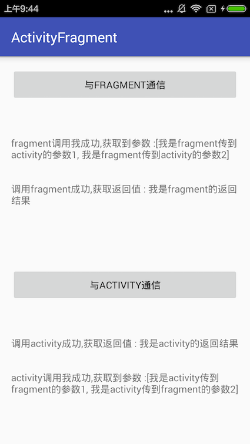

# ActivityFragment
Use the observer pattern to solve the activity and fragment Communications

## 概述

通常来说，解决activity和fragment通信的问题。我们都是采用如下几种方式，
handler，广播，EvnetBus，接口等。那么有没有一种更好的方式来实现呢，最近项目一只在使用Rx，这里参照了一下Rx的设计来解决如上问题。先来说说常用的几种方式。

## handler方式

这是一种最不好的初级方式，在fragment中调用activity中的handler发送信息，activity处理信息。缺点也十分明显，耦合性极强，并且获取不了activity的反馈，总之体验十分不好。

## 广播

这是一种另类的玩法，个人感觉大材小用了。广播适用于一对多且接收者不明确的情况下，
而且广播传播的信息需要实现序列化借口，总之是一种耗费性能的方式。

## EvnetBus

EvnetBus作为一款事件总线存在，可以用于Action的传递，但是这种方式的缺点有：是用反射（对性能有影响），EvnetBus发送者和接受者分离严重，不好维护，且不可以获取activity反馈，也不是十分理想。

## 接口

之前处理这类问题一直也是适应这种方式，总体来讲还是很不错。但是也有缺点，当项目大了的时候，就需要定义很多的接口，这时候就容易混淆，不好维护。

## 新大陆

总结一下Rx的设计思路，Rx和设计模式中的观察者十分类似。activity和fragment通信，实质上就是所谓事件的传递和响应，只是这个事件是一个特殊的事件，就是可以执行的方法（js中function也可以是参数），那么如果activity需要监听fragment的事件，只需要观察其相应事件即可，fragment同理。

如果对观察者不熟悉的可以看一下：[这就是观察者模式](http://droidyue.com/blog/2015/06/27/desgign-pattern-observer/)

### Observable

```java
public interface ObservableInterface<T, P, R> {

  /**
   * 根据名称注册观察者
   */
  void registerObserver(String name, T observer);

  /**
   * 根据名称反注册观察者
   */
  void removeObserver(String name);

  /**
   * 根据观察者反注册
   */
  void removeObserver(T observer);

  /**
   * 根据名称和观察者反注册
   */
  void removeObserver(String name, T observer);

  /**
   * 根据名称获取观察者
   */
  Set<T> getObserver(String name);

  /**
   * 清除观察者
   */
  void clear();

  /**
   * 通知观察者
   *
   * @param name 名称
   * @param p 参数
   * @return 返回值
   */

  R notify(String name, P... p);
}
```
### Observer

```java
public interface Function<Result, Param> {

  Result function(Param... data);
}
```

这里的Observer就是一个方法的抽象，包含 参数 和 返回值。在Activity和Fragment中传递的就是Fuction，在需要监听的地方注册事件，在适当的地方触发事件。下面看一下Observable的具体实现

### ObservableManager

```java
public class ObservableManager<Param, Result>
    implements ObservableInterface<Function, Param, Result> {

  private static final String TAG = "ObservableManager";
  private HashMap<String, Set<Function>> _mapping;
  private final Object _lockObj = new Object();
  private static ObservableManager _instance;

  public ObservableManager() {
    this._mapping = new HashMap<>();
  }

  public static ObservableManager newInstance() {
    if (_instance == null) _instance = new ObservableManager();
    return _instance;
  }

  @Override public void registerObserver(String name, Function observer) {
    synchronized (_lockObj) {
      Set<Function> observers;
      if (!_mapping.containsKey(name)) {
        observers = new HashSet<>();
        _mapping.put(name, observers);
      } else {
        observers = _mapping.get(name);
      }
      observers.add(observer);
    }
  }

  @Override public void removeObserver(String name) {
    synchronized (_lockObj) {
      _mapping.remove(name);
    }
  }

  @Override public void removeObserver(Function observer) {
    synchronized (_lockObj) {
      for (String key : _mapping.keySet()) {
        Set<Function> observers = _mapping.get(key);
        observers.remove(observer);
      }
    }
  }

  @Override public void removeObserver(String name, Function observer) {
    synchronized (_lockObj) {
      if (_mapping.containsKey(name)) {
        Set<Function> observers = _mapping.get(name);
        observers.remove(observer);
      }
    }
  }

  @Override public Set<Function> getObserver(String name) {
    Set<Function> observers = null;
    synchronized (_lockObj) {
      if (_mapping.containsKey(name)) {
        observers = _mapping.get(name);
      }
    }
    return observers;
  }

  @Override public void clear() {
    synchronized (_lockObj) {
      _mapping.clear();
    }
  }

  public Result notify(String name, Param... param) {
    synchronized (_lockObj) {
      if (_mapping.containsKey(name)) {
        Set<Function> observers = _mapping.get(name);
        for (Function o : observers) {
          return (Result) o.function(param);
        }
      }
      return null;
    }
  }
}
```
这里才用了一个HashMap来存储所有Observer集合，触发事件后就轮询集合循序之行，这就是观察者其中之一的缺点，一个Observer可能阻塞，影响其他执行。

## 使用

Activity中注册Function事件，Fragment中出发Function事件，执行的到结果，反之亦然。

```java
// 注册事件,Activity实现Function接口
ObservableManager.newInstance().registerObserver(FUNCTION_WITH_PARAM_AND_RESULT, this);
```

```java
//触发事件，并获得返回值
Object notify = ObservableManager.newInstance()
        .notify(MainActivity.FUNCTION_WITH_PARAM_AND_RESULT, "我是fragment传到activity的参数1", fragmentActivity,
            fragmentResult);
```

```java
//事件执行，实现于Function接口
@Override public Object function(Object[] data) {
   String text = activityResult.getText().toString() + "\n\n\n";

   activityResult.setText(text + "fragment调用我成功,获取到参数 :" + Arrays.asList(data));

   return "我是activity的返回结果";
 }
```

最终效果:



使用代码地址：[ActivityFragment](https://github.com/BoBoMEe/ActivityFragment)


